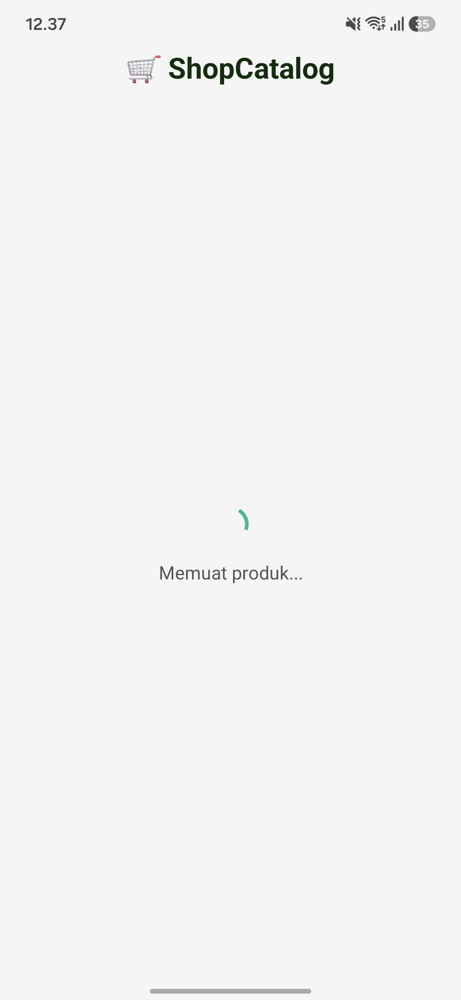
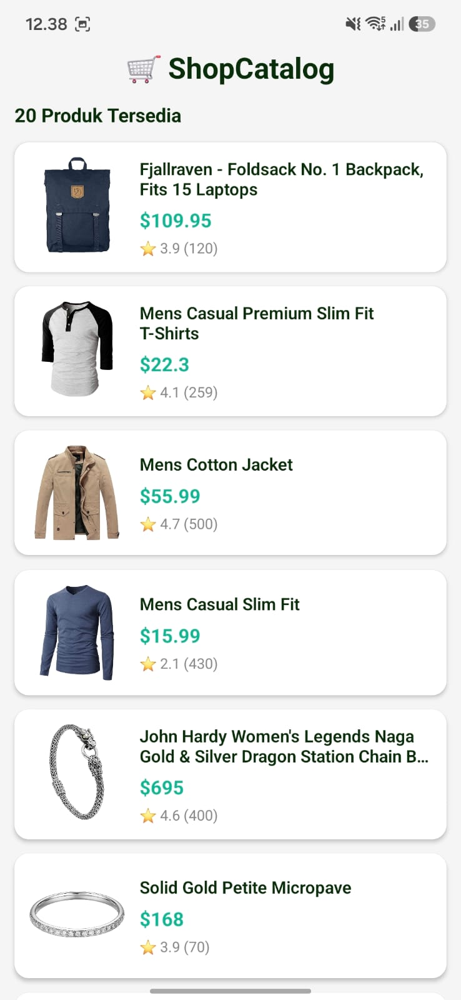
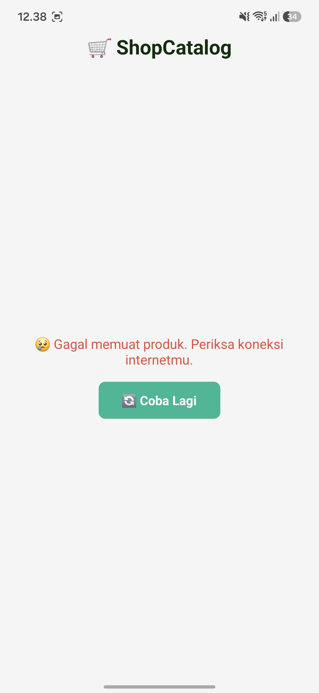

# 🛒 ShopCatalog

## Deskripsi Aplikasi

ShopCatalog adalah aplikasi katalog produk sederhana berbasis React Native dan Expo yang mengambil data produk dari FakeStore API menggunakan Axios. Aplikasi menampilkan daftar produk lengkap dengan gambar, nama produk, harga, dan rating secara real-time.

## API yang Digunakan

FakeStore API

Endpoint:
https://fakestoreapi.com/products

## Fitur Aplikasi

### Level 1

* Mengambil data dari REST API menggunakan Axios
* Menampilkan daftar produk menggunakan FlatList
* Menampilkan gambar produk
* Menampilkan nama produk, harga, dan rating
* Loading Indicator saat data sedang dimuat
* Error Handling saat terjadi kegagalan koneksi

### Level 2 (Dipilih)

✅ Retry Button (Coba Lagi)

Pengguna dapat mencoba mengambil data kembali ketika terjadi error dengan menekan tombol "Coba Lagi".

✅ Pull To Refresh

Pengguna dapat memperbarui data dengan menarik layar ke bawah (pull to refresh).

## Screenshot Aplikasi

### 1. Loading State

(Tambahkan screenshot loading dari Expo Go di sini)



### 2. Success State

(Tambahkan screenshot saat data berhasil ditampilkan)



### 3. Error State

(Tambahkan screenshot saat koneksi/API gagal)



## Cara Menjalankan Aplikasi

### 1. Clone Repository

```bash
git clone https://github.com/username/shopcatalog.git
cd shopcatalog
```

### 2. Install Dependencies

```bash
npm install
```

atau

```bash
npm install axios
```

### 3. Jalankan Aplikasi

```bash
npx expo start
```

### 4. Jalankan di HP

* Install aplikasi Expo Go
* Scan QR Code yang muncul pada terminal atau browser
* Aplikasi akan berjalan di perangkat Android/iOS

## Tech Stack

* React Native
* Expo
* Axios
* JavaScript (ES6)
* FakeStore API

## Link Expo Snack

Tambahkan link Expo Snack di bawah ini:

[https://snack.expo.dev/@username/shopcatalog](https://snack.expo.dev/@fatur07-02/amused-indigo-stroopwafels)

## Author

Nama : Muhammad Raihan Faturrahman

NIM : 243303621241

Program Studi Sistem Informasi

Universitas Prima Indonesia
